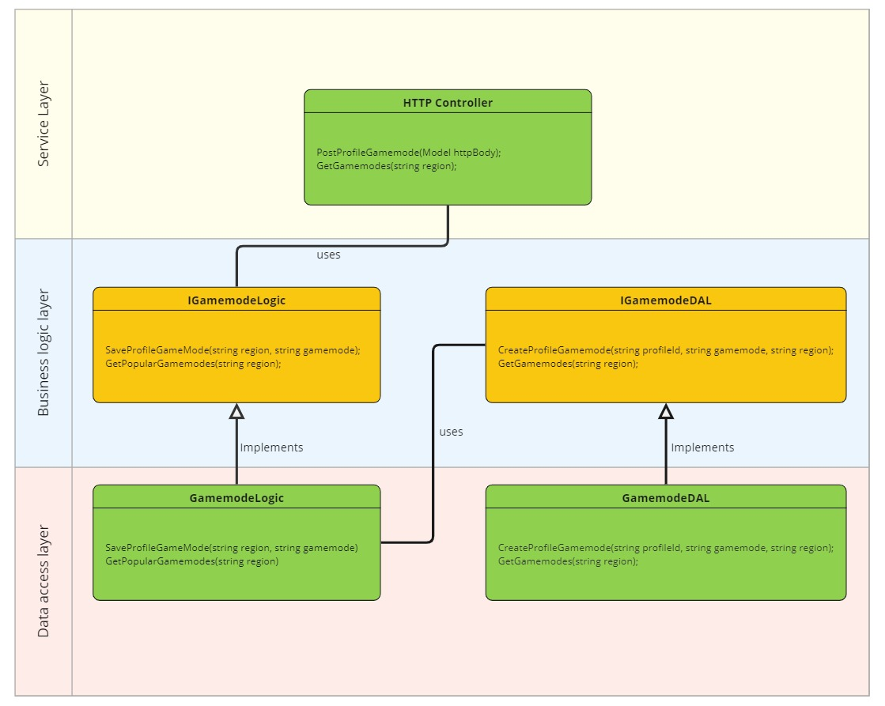

# Problem

You're building a massively popular online game for mobile phones with a number of multiplayer modes. You're in charge of designing a service that will
help players choose which game mode to play.

This service allows players to perform two operations:

1. The game reports the user's region and selected game mode.
2. The game queries the *current* most popular game modes for the region in which the player is located.

> Region is a string that contains an ISO-3166 country code. For example CA and US.

Please design a REST service to support those operations. It should scale to millions of concurrent users. Your design should include:

- REST API specification (endpoints, input parameters, output).
- Service layer design.
- Storage layer design (please explain data access patterns).
- A discussion of how your design will scale up to millions of CCUs.

# Solution

## Table of Contents

- [Problem](#problem)
- [Solution](#solution)
  - [Table of Contents](#table-of-contents)
  - [1. Requirements](#1-requirements)
  - [2. REST API](#2-rest-api)
    - [Report player's current region and gamemode.](#report-players-current-region-and-gamemode)
      - [Parameters](#parameters)
      - [Responses](#responses)
      - [Example Request/Response](#example-requestresponse)
    - [Request top gamemodes of a region](#request-top-gamemodes-of-a-region)
      - [Parameters](#parameters-1)
      - [Responses](#responses-1)
      - [Example Request/Response](#example-requestresponse-1)
  - [3. Application design](#3-application-design)
    - [1. Service layer](#1-service-layer)
      - [Model class](#model-class)
    - [2. Business Logic Layer](#2-business-logic-layer)
    - [3. Data Access Layer](#3-data-access-layer)
    - [Some Design Principles](#some-design-principles)
  - [4. Physical Data Storage](#4-physical-data-storage)
  - [5. Scalability Sonsiderations](#5-scalability-sonsiderations)
  - [6. Limitations](#6-limitations)


## 1. Requirements

* ### Functional Requirements
  * The service stores the player's current region and gamemode.
  * The service returns the list of top gamemodes for each region.

* ### Non Functional Requirements
  * The service has to scale up to 1 million concurrent users.

## 2. REST API

### Report player's current region and gamemode.

> Please expand each section

<details>
    <summary><code>POST</code> <code><b>/v1/profiles/{profileId}/gamemode</b></code> <code>(report player's region and gamemode)</code></summary>

#### Parameters

> | name      |  rqeuired | data type    | location  | description                                                           |
> |-----------|-----------|--------------|-----------|-----------------------------------------------------------------------|
> | profileId |  required | string       | path      | the unique identifier of the user reported by the game in UUID format |
> | region    |  required | string       | body      | the user's country in ISO-3166 format. e.g. CA                        |


#### Responses

> | http code     | content-type                      | response                                                            |
> |---------------|-----------------------------------|---------------------------------------------------------------------|
> | `200`         | `application/json;charset=UTF-8`        | `gamemode and region saved successfully`                      |
> | `400`         | `application/json:charset=UTF-8`        | `{"code":"400","message":"Bad Request"}`                      |

#### Example Request/Response

> ```javascript
>  POST /v1/profiles/934ba404-f883-4c76-b648-212c616c3735 HTTP/1.1
>  Host: api.samplegame.com
>  Content-Type: application/json
>  Accept: application/json
>  Accept-Charset: utf-8
>{
>	"region" : "CA"
>}
> ```

If successful, you will receive a response like that:

> ```javascript
> HTTP/1.1 200 OK
> Content-Type: application/json; charset=utf-8
> ```

</details>


------------------------------------------------------------------------------------------

### Request top gamemodes of a region

<details>
    <summary><code>GET</code> <code><b>/v1/regions/{region}/gamemode</b></code> <code>(get the top 5 popular gamemodes for the region)</code></summary>


#### Parameters

> | name      |  rqeuired | data type    | location  | description                                                           |
> |-----------|-----------|--------------|-----------|-----------------------------------------------------------------------|
> | region    |  required | string       | path      | the country code in ISO-3166 format. e.g. CA                          |
>

#### Responses

> | http code     | content-type                      | response                                                            |
> |---------------|-----------------------------------|---------------------------------------------------------------------|
> | `200`         | `application/json;charset=UTF-8`  | `check the below section`                                           |
> | `400`         | `application/json;charset=UTF-8`  | `{"code":"400","message":"Bad Request"}`                            |

#### Example Request/Response

> ```javascript
>  GET /v1/regions/CA/gamemode HTTP/1.1
>  Host: api.samplegame.com
>  Content-Type: application/json
>  Accept: application/json
>  Accept-Charset: utf-8
> ```

If successful, you will receive a response like that:

> ```javascript
> HTTP/1.1 200 OK
> Content-Type: application/json;charset=utf-8
> {
>    "gamemodes" : [
>       {
>           "mode":"GM01", 
>           "rank": 1
>       },
>       {
>           "mode":"GM02", 
>           "rank": 2
>       },
>       {
>           "mode":"GM03", 
>           "rank": 3
>       },
>       {
>           "mode":"GM04", 
>           "rank": 4
>       },
>       {
>           "mode":"GM05", 
>           "rank": 5
>       },
>   ]
> }
> ```

</details>

## 3. Application design

The overall design of the application uses a 3 layer architecture. 
* On the outermost layer, we have what is usually defined as "service layer" because it's the one layer that "serves" the callers which in this case is the incoming HTTP requests.
* The second layer that is used by the first layer is our business logic layer.
* The innermost layer is the data access layer that interacts with our physical data storage.

### 1. Service layer

This is the layer that interacts with the incoming HTTP requests and sends back the data. This layer is reponsible for a few things:
* Deserializing the HTTP JSON payload to our model classes.
* Validating the request for immediate errors (e.g. sending an empty profileId)
* Sending the proper validation errors and HTTP status codes in case of validation failure
* Calling the business logic layer and passing along the model objects.
* Receiving the response back from the business logic layer and serializing it to JSON to be sent back over HTTP to the client.
* Application level kill switching
* Starting a trace or perpetuating an existing trace that might have started in the game ( one of the pillars of observability. The other two being logs and metrics). Depending on the platform, this step might not be manual.
* Authentication and authorization if necessary
* Mapping the application level exceptions to error codes and http status codes.

#### Model class

Our model class maps the incoming HTTP payload to the business logic objects. In our case it has three simple properties: `ProfileId`, `Gamemode` and `Region`

### 2. Business Logic Layer

This is the layer that is not concerned with external interactions, like the previous layer, rather it focuses on the main logic of our application. It is responsible for:

* Application level validations, for example sending a Gamemode that doesn't exist, or is gated behind a season pass
* Logging and sending the required metrics for observability
* Interacting with the data layer to persist and retrieve data
* There are some key moments in the game that the application logic should be informed of and respond to. Two in particular are crucial 1) player connection 2) player disconnection

Our business logic class has two main methods for the two main use cases of this problem.

1. `SaveProfileGameMode(Model model)` This method receives the player's current gamemode and region from the game and saves it through the DAL. But it also has to do some validations. For example it might be the case that transition between a few gamemodes are unauthorized for some players. For example if you're not the holder of a season pass, you cannot play the GM10 gamemode.
   
2. `GetPopularGameModes(string region): [] string` This method receives a region and should return the *current* most popular gamemodes for that region. For the response we can use a model object to specify the rank for each gamemode as well.

### 3. Data Access Layer

This is the layer that interacts directly with our physical data storage. In the next section we will discuss our choice of data storage. This layer will use the SDK from the database vendor to interact with the physical storage. It is reponsible to open a connection, maintain the connection for the lifetime of the application

Our DAL has two main methods to support our business logic operations:

1. `CreateProfileGamemode(Model model)` This method writes directly to the storage. It saves `profileId`, `region` and the current `gamemode`. Because of the distributed nature of our application, this method has a subtle nuance that has to do with concurrency that we'll discuss in the next section.
2. `GetGameModes(string region): [] Gamemodes` This method looks up our storage and returns the top N gamemodes for each region. We'll discuss in the next section how this is achieved using our storage and data models.




### Some Design Principles

1. Using interfaces: This kinda adhere to the O of SOLID design principles. We try to have *loose couplings* between different layers. The logic layer references the data layer, but should not depend on the concrete implementation of the DAL. If we decide to change the implmentation of the physical storage and consequently our DALs, this should not affect the other layers whatsoever. Moreover this makes it much easier to write tests, because we can easily mock our DALs using mocking frameworks.

## 4. Physical Data Storage

## 5. Scalability Sonsiderations

## 6. Limitations