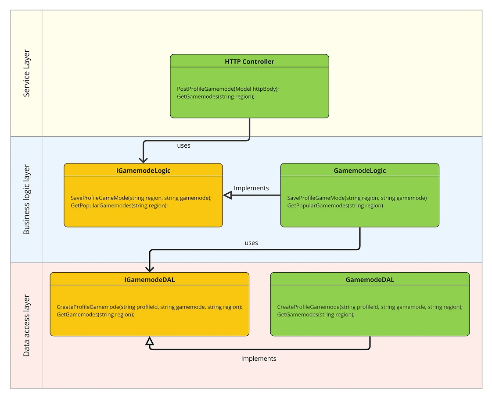

# Problem

You're building a massively popular online game for mobile phones with a number of multiplayer modes. You're in charge of designing a service that will
help players choose which game mode to play.

This service allows players to perform two operations:

1. The game reports the user's region and selected game mode.
2. The game queries the *current* most popular game modes for the region in which the player is located.

> Region is a string that contains an ISO-3166 country code. For example CA and US.

Please design a REST service to support those operations. It should scale to millions of concurrent users. Your design should include:

- REST API specification (endpoints, input parameters, output).
- Service layer design.
- Storage layer design (please explain data access patterns).
- A discussion of how your design will scale up to millions of CCUs.

# Solution

## Table of Contents

- [Problem](#problem)
- [Solution](#solution)
  - [Table of Contents](#table-of-contents)
  - [1. Requirements](#1-requirements)
  - [2. REST API](#2-rest-api)
    - [Report player's current region and gamemode.](#report-players-current-region-and-gamemode)
      - [Parameters](#parameters)
      - [Responses](#responses)
      - [Example Request/Response](#example-requestresponse)
    - [Request top gamemodes of a region](#request-top-gamemodes-of-a-region)
      - [Parameters](#parameters-1)
      - [Responses](#responses-1)
      - [Example Request/Response](#example-requestresponse-1)
  - [3. Service Layer](#3-service-layer)
  - [4. Data](#4-data)
  - [5. Scalability Sonsiderations](#5-scalability-sonsiderations)
  - [6. Limitations](#6-limitations)


## 1. Requirements

* ### Functional Requirements
  * The service stores the player's current region and gamemode.
  * The service returns the list of top gamemodes for each region.

* ### Non Functional Requirements
  * The service has to scale up to 1 million concurrent users.

## 2. REST API

### Report player's current region and gamemode.

<details>
    <summary><code>POST</code> <code><b>/v1/profiles/{profileId}/gamemode</b></code> <code>(report player's region and gamemode)</code></summary>

#### Parameters

> | name      |  rqeuired | data type    | location  | description                                                           |
> |-----------|-----------|--------------|-----------|-----------------------------------------------------------------------|
> | profileId |  required | string       | path      | the unique identifier of the user reported by the game in UUID format |
> | region    |  required | string       | body      | the user's country in ISO-3166 format. e.g. CA                        |


#### Responses

> | http code     | content-type                      | response                                                            |
> |---------------|-----------------------------------|---------------------------------------------------------------------|
> | `200`         | `application/json;charset=UTF-8`        | `gamemode and region saved successfully`                      |
> | `400`         | `application/json:charset=UTF-8`        | `{"code":"400","message":"Bad Request"}`                      |

#### Example Request/Response

> ```javascript
>  POST /v1/profiles/934ba404-f883-4c76-b648-212c616c3735 HTTP/1.1
>  Host: api.samplegame.com
>  Content-Type: application/json
>  Accept: application/json
>  Accept-Charset: utf-8
>{
>	"region" : "CA"
>}
> ```

If successful, you will receive a response like that:

> ```javascript
> HTTP/1.1 200 OK
> Content-Type: application/json; charset=utf-8
> ```

</details>


------------------------------------------------------------------------------------------

### Request top gamemodes of a region

<details>
    <summary><code>GET</code> <code><b>/v1/regions/{region}/gamemode</b></code> <code>(get the top 5 popular gamemodes for the region)</code></summary>


#### Parameters

> | name      |  rqeuired | data type    | location  | description                                                           |
> |-----------|-----------|--------------|-----------|-----------------------------------------------------------------------|
> | region    |  required | string       | path      | the country code in ISO-3166 format. e.g. CA                          |
>

#### Responses

> | http code     | content-type                      | response                                                            |
> |---------------|-----------------------------------|---------------------------------------------------------------------|
> | `200`         | `application/json;charset=UTF-8`  | `check the below section`                                           |
> | `400`         | `application/json;charset=UTF-8`  | `{"code":"400","message":"Bad Request"}`                            |

#### Example Request/Response

> ```javascript
>  GET /v1/regions/CA/gamemode HTTP/1.1
>  Host: api.samplegame.com
>  Content-Type: application/json
>  Accept: application/json
>  Accept-Charset: utf-8
> ```

If successful, you will receive a response like that:

> ```javascript
> HTTP/1.1 200 OK
> Content-Type: application/json;charset=utf-8
> {
>    "gamemodes" : [
>       {
>           "mode":"GM01", 
>           "rank": 1
>       },
>       {
>           "mode":"GM02", 
>           "rank": 2
>       },
>       {
>           "mode":"GM03", 
>           "rank": 3
>       },
>       {
>           "mode":"GM04", 
>           "rank": 4
>       },
>       {
>           "mode":"GM05", 
>           "rank": 5
>       },
>   ]
> }
> ```

</details>

## 3. Service Layer



## 4. Data

## 5. Scalability Sonsiderations

## 6. Limitations