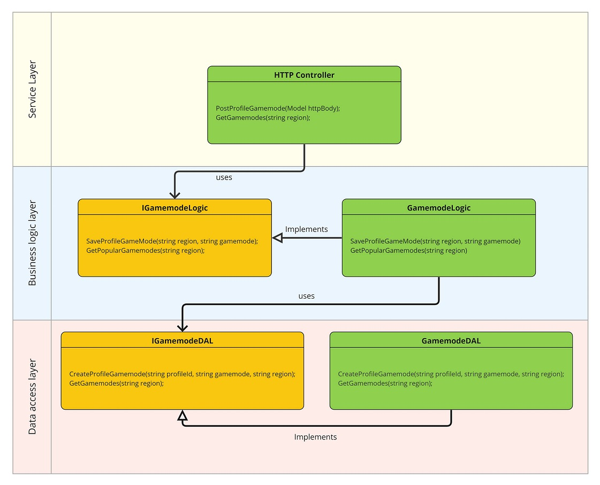
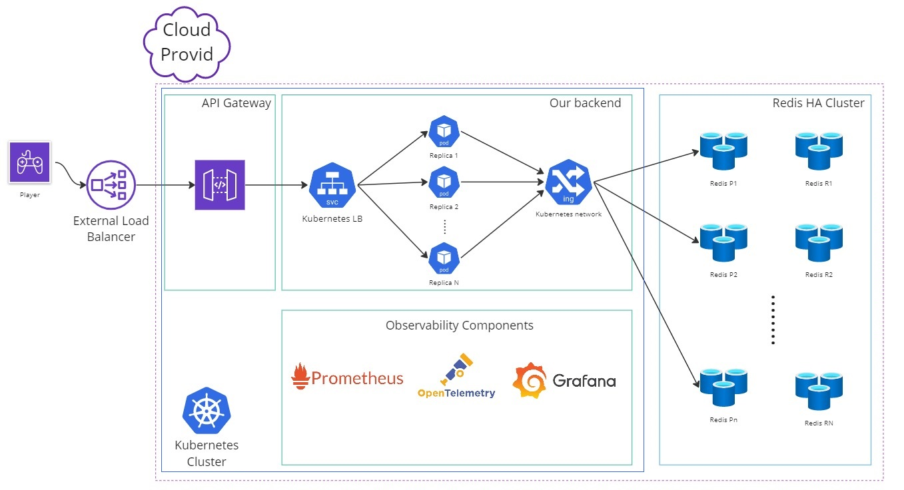
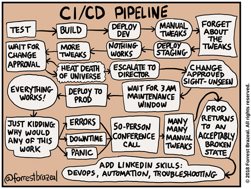

# Problem

You're building a massively popular online game for mobile phones with a number of multiplayer modes. You're in charge of designing a service that will
help players choose which game mode to play.

This service allows players to perform two operations:

1. The game reports the user's region and selected game mode.
2. The game queries the *current* most popular game modes for the region in which the player is located.

> Region is a string that contains an ISO-3166 country code. For example CA and US.

Please design a REST service to support those operations. It should scale to millions of concurrent users. Your design should include:

- REST API specification (endpoints, input parameters, output).
- Service layer design.
- Storage layer design (please explain data access patterns).
- A discussion of how your design will scale up to millions of CCUs.

# Solution

## Table of Contents

- [Problem](#problem)
- [Solution](#solution)
  - [Table of Contents](#table-of-contents)
  - [1. Requirements](#1-requirements)
  - [2. REST API](#2-rest-api)
    - [Report player's current region and gamemode.](#report-players-current-region-and-gamemode)
      - [Parameters](#parameters)
      - [Responses](#responses)
      - [Example Request/Response](#example-requestresponse)
    - [Request top gamemodes of a region](#request-top-gamemodes-of-a-region)
      - [Parameters](#parameters-1)
      - [Responses](#responses-1)
      - [Example Request/Response](#example-requestresponse-1)
  - [3. Application Design](#3-application-design)
    - [1. Service Layer](#1-service-layer)
      - [Model class](#model-class)
    - [2. Business Logic Layer](#2-business-logic-layer)
    - [3. Data Access Layer](#3-data-access-layer)
    - [Some Design Principles of Note](#some-design-principles-of-note)
  - [4. Physical Data Storage](#4-physical-data-storage)
    - [Enter Redis](#enter-redis)
    - [Data Model](#data-model)
    - [Data Access Patterns](#data-access-patterns)
  - [5. Scalability Sonsiderations](#5-scalability-sonsiderations)
    - [What is Scalability?](#what-is-scalability)
    - [VMs on the Cloud](#vms-on-the-cloud)
    - [Containers](#containers)
    - [Kubernetes](#kubernetes)
    - [Redis](#redis)
    - [Other Pieces](#other-pieces)
  - [6. Limitations and Challenges](#6-limitations-and-challenges)
  - [7. Final Words](#7-final-words)


## 1. Requirements

* ### Functional Requirements
  * The service stores the player's current region and gamemode.
  * The service returns the list of top gamemodes for each region.

* ### Non Functional Requirements
  * The service has to scale up to 1 million concurrent users.

## 2. REST API

### Report player's current region and gamemode.

> Please expand each section

<details>
    <summary><code>POST</code> <code><b>/v1/profiles/{profileId}/gamemode</b></code> <code>(report player's region and gamemode)</code></summary>

#### Parameters

> | name      |  rqeuired | data type    | location  | description                                                           |
> |-----------|-----------|--------------|-----------|-----------------------------------------------------------------------|
> | profileId |  required | string       | path      | the unique identifier of the user reported by the game in UUID format |
> | region    |  required | string       | body      | the user's country in ISO-3166 format. e.g. CA                        |
> | gamemode  |  required | string       | body      | the user's gamemode e.g. GM01                                         |


#### Responses

> | http code     | content-type                      | response                                                            |
> |---------------|-----------------------------------|---------------------------------------------------------------------|
> | `200`         | `application/json;charset=UTF-8`        | `gamemode and region saved successfully`                      |
> | `400`         | `application/json:charset=UTF-8`        | `{"code":"400","message":"Bad Request"}`                      |

#### Example Request/Response

> ```javascript
>  POST /v1/profiles/934ba404-f883-4c76-b648-212c616c3735 HTTP/1.1
>  Host: api.samplegame.com
>  Content-Type: application/json
>  Accept: application/json
>  Accept-Charset: utf-8
>{
>	"region" : "CA",
> "gamemode" : "GM01"
>}
> ```

If successful, you will receive a response like that:

> ```javascript
> HTTP/1.1 200 OK
> Content-Type: application/json; charset=utf-8
> ```

</details>


------------------------------------------------------------------------------------------

### Request top gamemodes of a region

<details>
    <summary><code>GET</code> <code><b>/v1/regions/{region}/gamemode</b></code> <code>(get the top 5 popular gamemodes for the region)</code></summary>


#### Parameters

> | name      |  rqeuired | data type    | location  | description                                                           |
> |-----------|-----------|--------------|-----------|-----------------------------------------------------------------------|
> | region    |  required | string       | path      | the country code in ISO-3166 format. e.g. CA                          |
>

#### Responses

> | http code     | content-type                      | response                                                            |
> |---------------|-----------------------------------|---------------------------------------------------------------------|
> | `200`         | `application/json;charset=UTF-8`  | `check the below section`                                           |
> | `400`         | `application/json;charset=UTF-8`  | `{"code":"400","message":"Bad Request"}`                            |

#### Example Request/Response

> ```javascript
>  GET /v1/regions/CA/gamemode HTTP/1.1
>  Host: api.samplegame.com
>  Content-Type: application/json
>  Accept: application/json
>  Accept-Charset: utf-8
> ```

If successful, you will receive a response like that:

> ```javascript
> HTTP/1.1 200 OK
> Content-Type: application/json;charset=utf-8
> {
>    "gamemodes" : [
>       {
>           "mode":"GM01", 
>           "rank": 1
>       },
>       {
>           "mode":"GM02", 
>           "rank": 2
>       },
>       {
>           "mode":"GM03", 
>           "rank": 3
>       },
>       {
>           "mode":"GM04", 
>           "rank": 4
>       },
>       {
>           "mode":"GM05", 
>           "rank": 5
>       },
>   ]
> }
> ```

</details>


## 3. Application Design

The overall design of the application uses a 3 layer architecture. 
* On the outermost layer, we have what is usually defined as "service layer" because it's the one layer that "serves" the callers which in this case is the incoming HTTP requests.
* The second layer that is used by the first layer is our business logic layer.
* The innermost layer is the data access layer that interacts with our physical data storage.

### 1. Service Layer

This is the layer that interacts with the incoming HTTP requests and sends back the data. This layer is responsible for a few things:
* Deserializing the HTTP JSON payload to our model classes.
* Validating the request for immediate errors (e.g. sending an empty profileId)
* Sending the proper validation errors and HTTP status codes in case of validation failure
* Calling the business logic layer and passing along the model objects.
* Receiving the response back from the business logic layer and serializing it to JSON to be sent back over HTTP to the client.
* Application level kill switching
* Starting a trace or perpetuating an existing trace that might have started in the game ( one of the pillars of observability. The other two being logs and metrics). Depending on the platform, this step might not be manual.
* Authentication and authorization if necessary
* Mapping the application level exceptions to error codes and HTTP status codes.

#### Model class

Our model class maps the incoming HTTP payload to the business logic objects. In our case it has three simple properties: `ProfileId`, `Gamemode` and `Region`

### 2. Business Logic Layer

This is the layer that is not concerned with external interactions, like the previous layer, rather it focuses on the main logic of our application. It is responsible for:

* Application level validations, for example sending a Gamemode that doesn't exist or is gated behind a season pass
* Logging and sending the required metrics for observability
* Interacting with the data layer to persist and retrieve data
* There are some key moments in the game that the application logic should be informed of and respond to. Two, in particular, are crucial 1) player connection 2) player disconnection

Our business logic class has two main methods for the two main use cases of this problem.

1. `SaveProfileGameMode(Model model)` This method receives the player's current gamemode and region from the game and saves it through the DAL. But it also has to do some validations. For example, it might be the case that transitions between a few gamemodes are unauthorized for some players. For example, if you're not the holder of a season pass, you cannot play the GM10 gamemode.
   
2. `GetPopularGameModes(string region): [] string` This method receives a region and should return the *current* most popular gamemodes for that region. For the response we can use a model object to specify the rank for each gamemode as well.

### 3. Data Access Layer

This is the layer that interacts directly with our physical data storage. In the next section, we will discuss our choice of data storage. This layer will use the SDK from the database vendor to interact with the physical storage. It is responsible to open a connection, and maintain the connection for the lifetime of the application

Our DAL has two main methods to support our business logic operations:

1. `CreateProfileGamemode(Model model)` This method writes directly to the storage. It saves `profileId`, `region` and the current `gamemode`. Because of the distributed nature of our application, this method has a subtle nuance that has to do with concurrency that we'll discuss in the next section.
2. `GetGameModes(string region): [] Gamemodes` This method looks up our storage and returns the top N gamemodes for each region. We'll discuss in the next section how this is achieved using our storage and data models.




### Some Design Principles of Note

1. Using interfaces: This kinda adheres to the O of SOLID design principles. We try to have *loose couplings* between different layers. The logic layer references the data layer, but should not depend on the concrete implementation of the DAL. If we decide to change the implmentation of the physical storage and consequently our DALs, this should not affect the other layers whatsoever. Moreover, this makes it much easier to write tests, because we can easily mock our DALs using mocking frameworks.
2. Dependency Injection: It is ideal to inject dependencies (from constructors) using a dependency injection container which also manages the lifetime of our classes.

## 4. Physical Data Storage

One of the functional requirements of our application formulates that we are only interested in the current state of our players. We don't care about the past game sessions and gamemodes, we don't care about the disconnected players, but we do care about the ones that are playing. So our data is transient. That is the key to our choice of data storage.

### Enter Redis

Redis is an open-source, in-memory data structure store that is often used as a high-performance database, cache, and message broker. It is known for its speed, versatility, and ease of use.

One of Redis' key features is its ability to store and manipulate complex data structures, including strings, hashes, lists, sets, and *sorted sets*. It has a wide range of commands and operations for manipulating these data structures, making it a powerful tool for data analysis, message processing, and real-time applications.

Redis is particularly well-suited for transient data storage because it stores data in memory, which allows for very fast read and write operations. However, Redis also provides options for persisting data to disk, making it possible to use Redis for long-term data storage as well.

I have former experience with Redis building a data store for matchmaking. In my experience, the sorted set data structure is a perfect candidate to model our data. Moreover, Redis shines in terms of performance when keeping the transient data in memory without the need to write on the disk. This is the case for us.

### Data Model

We have two data structures for two different use cases. Hash to store profile data and sorted sets to store gamemode rankings per region.

1. **Hash** for the profile data
   Redis hashes are record types structured as collections of field-value pairs. You can use hashes to represent basic objects and to store groupings of counters, among other things. We store our profile id as the key and two fields of region and gamemode.

``` javascript
    > HSET profiles:934ba404-f883-4c76-b648-212c616c3735 gamemode GM01
    (integer) 1
    > HSET profiles:934ba404-f883-4c76-b648-212c616c3735 region CA
    (integer) 1
    > HSET profiles:7314c2e3-e87f-4aaf-aef6-5cc372fe3bd8 gamemode GM01
    (integer) 1
    > HSET profiles:7314c2e3-e87f-4aaf-aef6-5cc372fe3bd8 region US
    (integer) 1
```

2. **Sorted Sets** for the gamemode rankings per region.
   A Redis sorted set is a collection of unique strings (members) ordered by an associated score. For example, you can use sorted sets to easily maintain ordered lists of the highest scores in a massive online game. For our case, we store region as the key and gamemode as the value and increment the score every time a player in that region enters that gamemode. This allows us to easily get the top N records for that region. It's blazing fast with an `O(log(n))` time complexity for the two operations we will use them for.

``` javascript
    > ZINCRBY regions:CA 1 GM01
    "1"
    > ZINCRBY regions:FR 1 GM01
    "1"
    > ZINCRBY regions:US 2 GM02
    "2"
```

  And if we want to get the top 3 ranks in the CA region:


``` javascript
    > ZREVRANGE regions:CA 0 2 WITHSCORES
    1) "GM03"
    2) "11"
    3) "GM02"
    4) "10"
    5) "GM01"
    6) "4"
    7) "GM04"
    8) "0"
```

### Data Access Patterns

Our physical data storage must support the two operations defined in our application data access layer. In this section we discuss how we can leverage Redis to support these two operations.

* `CreateProfileGamemode(Model model)`
  This method at its core does a few operations
  1. Remove the previous gamemode from the user's data.
  2. Add the new gamemode to the user's data, in this case if the hash field doesn't exist, add it or if it does overwrite it with the new gamemode value.
  3. Increment the new gamemode ranking for the user's region.
  4. Decrement the previous gamemode ranking for the user's region.
   
   There are a few considerations here.
   * All these operations should run together atomically. This is an ACID requirement. Redis has support for transactions using a few commands which guarantees two important things.
     * All commands in a transaction are serialized and executed sequentially. A request sent by another client will never be served in the middle of the execution of a Redis Transaction.
     * If the commit step of the transaction is not executed, or if the server calling the commit command loses the connection before that step (ah, yes we have multiple servers and we shall explain that in the Scalability section), none of these commands are executed.
  
  ``` javascript
      > MULTI // this is the comand that signals the start of a transaction
      > OK // response from Redis
      > HSET profiles:934ba404-f883-4c76-b648-212c616c3735 gamemode GM02 region US // this command writes the new values to the user's fields
      > QUEUED // response from Redis
      > ZINCRBY regions:CA -1 GM01
      > QUEUED // response from Redis
      > ZINCRBY regions:US  1 GM02
      > QUEUED // response from Redis
      > EXEC
      > 1) "2"
        2) "3"
        3) "3"
  ```
   * Another consideration is that we want this command executed only once in Isolation. Another ACID requirement. What do we mean by that? Well, because of the distribution of our web servers which is the response to 1 million concurrent users and scalability needs, we have multiple web servers running the application and it might be the case that the request to run this transaction be sent by various webservers simultaneously. This situation we should protect our data against. Redis offers an optimistic locking mechanism that allows you to watch one or more keys in order to detect changes against them. If at least one watched key is modified before the EXEC command, the whole transaction aborts and EXEC returns a Null reply to notify that the transaction failed. We use the `WATCH` command to monitor a key.

  ``` javascript
      > WATCH profiles:934ba404-f883-4c76-b648-212c616c3735 regions:CA regions:US
      > MULTI
      > OK
      > HSET profiles:934ba404-f883-4c76-b648-212c616c3735 gamemode GM02 region US
      > QUEUED
      > ZINCRBY regions:CA -1 GM01
      > QUEUED
      > ZINCRBY regions:US  1 GM02
      > QUEUED
      > EXEC
      > 1) "2"
        1) "3"
        2) "3"
  ```
    Using the above code, if there are race conditions and another client modifies the profile in the time between our call to WATCH and our call to EXEC, the transaction will fail.

* `GetGameModes(string region): [] Gamemodes`: This is a readonly method and is easily supported as a consequence of our choice of data models. We just probe our sorted set for the top N records. Because it's already sorted, this is blazing fast with an `O(log(n))` complexity as stated above.

``` javascript
    > ZREVRANGE regions:CA 0 2 WITHSCORES
    1) "GM03"
    2) "11"
    3) "GM02"
    4) "10"
    5) "GM01"
    6) "4"
```

## 5. Scalability Sonsiderations

### What is Scalability?

When we talk about scalability we are really talking about our hardware environment. Our web servers run on a physical machine that can do only so many operations. When we talk about running a REST API on a server depending on the expected load on our web server (that is sometimes measured by request/seconds or in our context by concurrent users) the discussion can change. If we expect a low load that can be handled by that one physical machine, and if it increases to an extent we can always add better hardware to our machine, increase memory, add more SSDs, better CPU, and so on. That is vertical scaling or scaling up. But obviously, in a context of one million concurrent users, we can scale up only so much. After which we have to add more machines that can handle the load. What is commonly referred to as horizontal scaling or scaling out

When we choose horizontal scalability there are a few questions that naturally arise. For example, what type of machines are we going to need? Should we buy physical devices and set them up manually? Maybe. That depends on a few factors. But there are some hurdles if we go that way. The most challenging part of that is to set them up. That requires tremendous effort on the networking side, setting up physical equipment, a fast and reliable internet connection, and a dedicated team of experts to oversee the entire operation for the lifetime of our app. For most businesses that's not a viable solution.

### VMs on the Cloud

Fortunately nowadays with the advent of virtualization technologies and cloud computing, you don't really need to do any of that. What you would do instead is to rent virtual machines on a cloud provider and run your web servers (and obviously your dependencies like your Redis) on those machines.

Multiple problem arises from running web servers running on multiple Virutal Machines.

1. *Resource Overhead*: VMs require a significant amount of resources, including CPU, memory, and storage. Each VM requires its own operating system and software stack, which can result in higher resource utilization and overhead. This can lead to higher costs and potentially slower performance.
2. *Scalability*: Scaling VMs can be a challenge, as it often involves manually adding or removing virtual machines. This can be time-consuming and can lead to downtime or performance issues during scaling events.
3. *Boot Time*: VMs can take a long time to boot up and become available, which can affect availability and scalability.
4. *Configuration Management*: Managing and maintaining the configuration of VMs can be complex, particularly if you have a large number of virtual machines running across multiple regions.
5. *Security*: Ensuring the security of VMs can be challenging, as each VM requires its own operating system and software stack, which can result in a larger attack surface.
6. *Vendor Lock-in*: Using VMs in the cloud can lead to vendor lock-in, as each cloud provider has their own virtualization technology and API, which can make it difficult to switch providers in the future.

### Containers

Because of all these issues, we should strive to do better. Luckily containers can resolve most of these issues. Containers are lightweight and isolated environments for running software applications, including all dependencies and configurations. They provide efficient and portable deployment options and can be easily managed using container orchestration systems like Kubernetes which we'll discuss below. Containers can resolve most of the issues with VMs:

1. *Resource Utilization*: Containers are a more lightweight and efficient alternative to VMs. They share the underlying operating system and hardware resources, resulting in lower resource utilization and overhead. This can lead to cost savings and improved performance.

2. *Scalability*: Container orchestration systems, such as Kubernetes, make it easy to scale containers up or down automatically in response to changes in demand. This can help ensure high availability and prevent performance issues during scaling events.

3. *Boot Time*: Containers start up quickly, which can improve availability and scalability. Containers can be started in seconds, compared to minutes or even hours for VMs.

4. *Configuration Management*: Containers are easier to manage and maintain than VMs. They can be defined and managed using infrastructure-as-code tools like Docker Compose and Kubernetes YAML files. This makes it easier to manage large numbers of containers across multiple regions and environments.

5. *Security*: Containers offer built-in isolation and security features, such as namespace isolation and container network segmentation. These features can help reduce the attack surface and improve security compared to VMs.

6. *Vendor Lock-in*: Containers are highly portable and can be run on any container runtime or cloud provider that supports the container format. This makes it easier to switch providers or move workloads between environments without vendor lock-in.

If we choose to run our web servers on containers that run on VMs, the first choice would be to manually manage them. But that comes with challenges:

1. *Manual Scaling*: scaling containers requires manual intervention. This can be time-consuming and error-prone and can lead to downtime or degraded performance if not done properly.

2. *Limited Resource Utilization*: VMs are typically provisioned with a fixed amount of resources, which can result in underutilization or overprovisioning of resources for individual containers.

3. *Limited Load Balancing*: load balancing must be done manually or with limited built-in tools provided by the container runtime. This can result in uneven distribution of traffic and overloading of individual containers.

4. *Limited Self-Healing*: When containers fail or become unresponsive, manual intervention is required to restart or replace them which is time-consuming and tedious.


### Kubernetes

So all the roads lead to an orchestration framework that can facilitate the running of our containers. Kubernetes is an open-source container orchestration platform that automates the deployment, scaling, and management of containerized applications. It provides a set of tools for managing containers, including automatic scaling, load balancing, self-healing, and efficient resource utilization, making it a good choice for building and operating highly scalable and resilient applications. Some of the reasons why an container orchestration framework like Kubernetes is essential are:

1. **Simplified Management**: it simplifies the management of containerized applications by automating many of the tasks involved in deploying, scaling, and updating them. This allows us to focus on writing code rather than worrying about infrastructure.
2. **Automatic Scaling**: Kubernetes can automatically scale the number of containers running based on demand. This means that as traffic increases, Kubernetes can quickly spin up additional containers to handle the load. Similarly, when traffic decreases, Kubernetes can scale down the number of containers to reduce costs.
3. **Load Balancing**: Kubernetes includes built-in load-balancing capabilities to distribute traffic across containers running in a cluster. This ensures that traffic is evenly distributed and that containers are not overloaded.
4. **Self-Healing**: Kubernetes monitors the health of containers and can automatically restart or replace containers that fail or become unresponsive. This ensures that applications remain available and responsive, even in the event of failures.
5. **Resource Optimization**: Kubernetes can optimize resource allocation by scheduling containers on nodes with available resources. This ensures that resources are utilized efficiently and that containers are not over-provisioned.


### Redis

Now that we have some degree of confidence in our application's ability to scale, we need to talk about our data storage scalability. 
Our choice of storage, Redis, offers a key feature that can facilitate scalability:

**Cluster mode**: Redis has support for cluster mode, which allows for both read and write scalability. In cluster mode, Redis partitions the data across multiple nodes and automatically distributes reads and writes across the nodes. Redis clients are aware of the target node in the cluster and can read/write from/to that node directly. But this is not mandatory and they can read/write from/to any node. This will be auto-routed by the cluster after read/write is done.
Cluster mode offers replications for each node to prevent a single point of failure and provides high availability. In Redis, this is provided by the master-replica model. It does automatic failover when the primary node is unhealthy. 
It also has support for automatic sharding and resharding. Sharding is done automatically across multiple nodes using a hash slot sharding strategy. There are 16384 hash slots in Redis Cluster, and to compute the hash slot for a given key, it simply takes the CRC16 of the key modulo 16384. Every node in a Redis Cluster is responsible for a subset of the hash slots. This makes it easy to add and remove cluster nodes dynamically without any downtime. In conclusion using the cluster mode makes scaling up and down as needed rather easy with Redis.

### Other Pieces

Kubernetes to a great extent facilitates our requirements. It handles load balancing, managing the lifetime of the containers, scaling up and down of our instances, resiliency, and resource management. But we still need a few more pieces to have a working solution. Namely an API Gateway, Edge Load Balancer, and Observability Stack.

1. **API Gateway**: API Gateway is the single entry point of external traffic to the application that provides a layer of abstraction between the application's microservices and extertnal traffic. It offers service discovery and routing of the requests to the appropriate Kubernetes services. It can offer authentication and authorization, rate limiting, request validation, encryption, and so on. On top of all of that analytics and monitoring of the traffic can also be offloaded to API Gateway. Some of the choices of API Gateway software are Kong, Istio, Traefik, and Ambassador.
2. **Edge Load Balancer**: An edge or external HTTP(S) load balancer is a proxy-based Layer 7 load balancer that enables you to run and scale your services behind a single external IP address. The external HTTP(S) load balancer distributes HTTP and HTTPS traffic to backends hosted on a variety of your cloud platforms (such as the Kubernetes cluster). This load balancer connects the incoming traffic to downstream API Gateway. This is usually provided by the Cloud Provider.
3. **Observability Stack**: This is not related to the Scalability considerations but it's worth mentioning as part of our global architecture. Observability refers to the ability to measure a system's current state based on the data it generates, such as logs, metrics, and traces. This is important because the cloud-native environments has gotten more complex and troubleshooting the root cause of a failure have become more difficult to pinpoint. This enables us to collect relevant data and be proactive about our system and address a potential bottleneck. The three pillars of observability are logs, metrics, and traces. The industry relies on standard practices and widely accepted software and tools to implement observability. OpenTelemetry, Prometheus, and Grafana are some of the accepted tools that can help us achieve observability goals.




## 6. Limitations and Challenges

While Kubernetes and Cloud facilitate our scalability issues, help us reduce costs, and offer a reliable solution to our 1 million CCU problem, it also comes at a cost and certain challenges. Some of the challenges of Kubernetes are:
* **Complexity**: It has many moving parts and requires a good understanding of how all the components work together.
* **Steep Learning Curve**: Learning all those moving parts has a steep curve if prior knowledge is minimal.
* **Scalability is not easy**: Even though the goal of using Kubernetes is to have seamless scalability without downtime, getting it right is not easy. It requires using many components and careful planning and considerations. Horizontal Pod Autoscalar (HPA) is the component that automatically scales the number of replicas based on CPU usage, memory utilization, or custom metrics. It uses the Kubernetes Metrics API to gather utilization metrics and dynamically adjusts the number of replicas based on the specified target CPU or memory utilization. To get these values right, you need to carefully scrutinize your application and this is not easy. Other components that are needed to be configured carefully include a PodDistributionBudget, Libeness/readiness probes, services, and ingresses, 
* **Reduced Developer Focus**: To get k8s right, developers need to spend a nontrivial amount of time to build and operate it which can be used elsewhere. Let's take the simple case of running a test suite on the developer's machine. You know we all had that case where it works on our machine but not on our CI/CD pipeline. So we want to reproduce that issue locally, but it never is easy.



* **CI/CD pipeline**: Speaking the of CI/CD pipeline, we'd be remiss if we didn't mention that. CI/CD is the bridge between source code and Kubernetes. Because k8s has a lot of complexity and your team has certain requirements and the choices are too many, getting it right takes time, patience, and many many iterations.
* **Challenges of Redis**: Our data storage, Redis comes with its own set of challenges and limitations. For example, we discussed the case of dynamic resharding. That operation is not cheap. Data needs to move around when we need to add or remove a node and that can be time-consuming and resource intensive which causes performance overhead. Consistency is also limited. The case of HA comes with a nonzero chance that a slave node is promoted to master right after the master has accepted a write but it hasn't been propagated to the slave just yet. And that is a tradeoff between performance and consistency. A limitation that we should be aware of. Getting the clustering right, if we choose to manage it ourselves can be complex which requires careful configuration and monitoring to ensure data is distributed evenly.

## 7. Final Words

Thank you for taking the time to read my words. I understand that I might have gone at length, especially when discussing scalability concerns. The reason for that is that I had a path to get to the discussions around Kubernetes and how using it will solve a lot of problems. I had to walk that path, from the case for manual scalability and the problems with that which leads to the next logical iteration, how we might want to consider containers and what are the pros/cons of going that route to eventually reach the final design which was managed Kubernetes on a cloud provider. This is obviously not a perfect solution and as I stated comes with many pain points and challenges and there is room for further iterations and improvements. The reason I landed there is that setup is how I've created and operated a system that had to serve 1 million CCU. That system is still in use today and we're further improving it. But those discussions are beyond the scope of this document.
